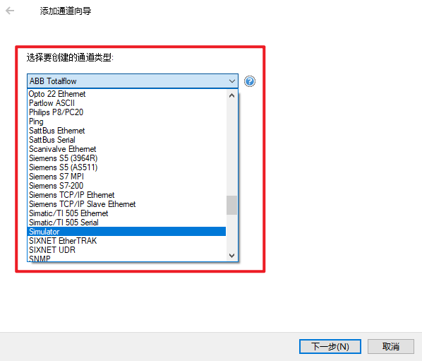
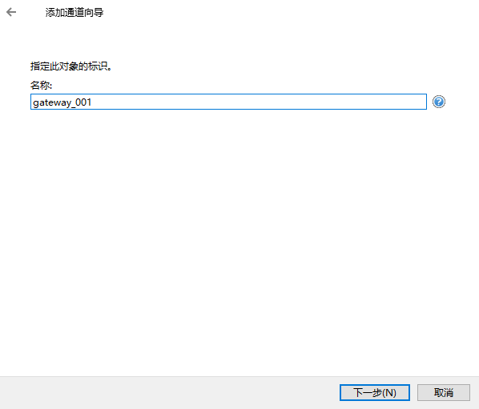
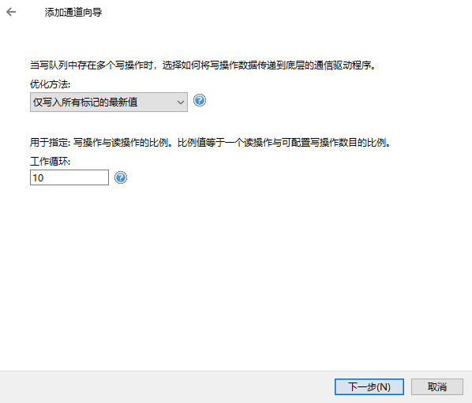
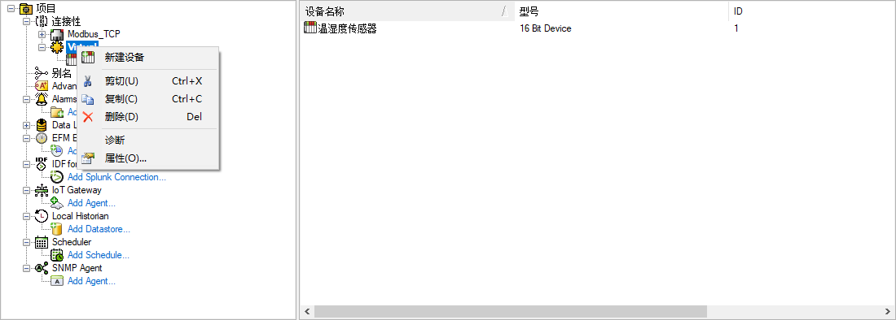
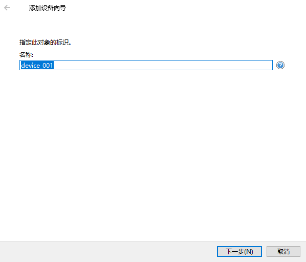
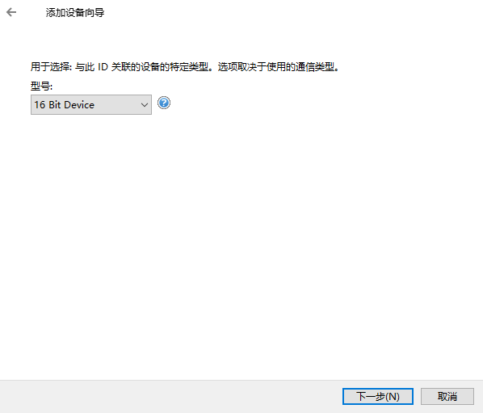
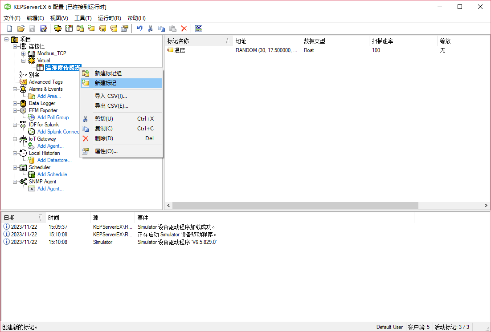
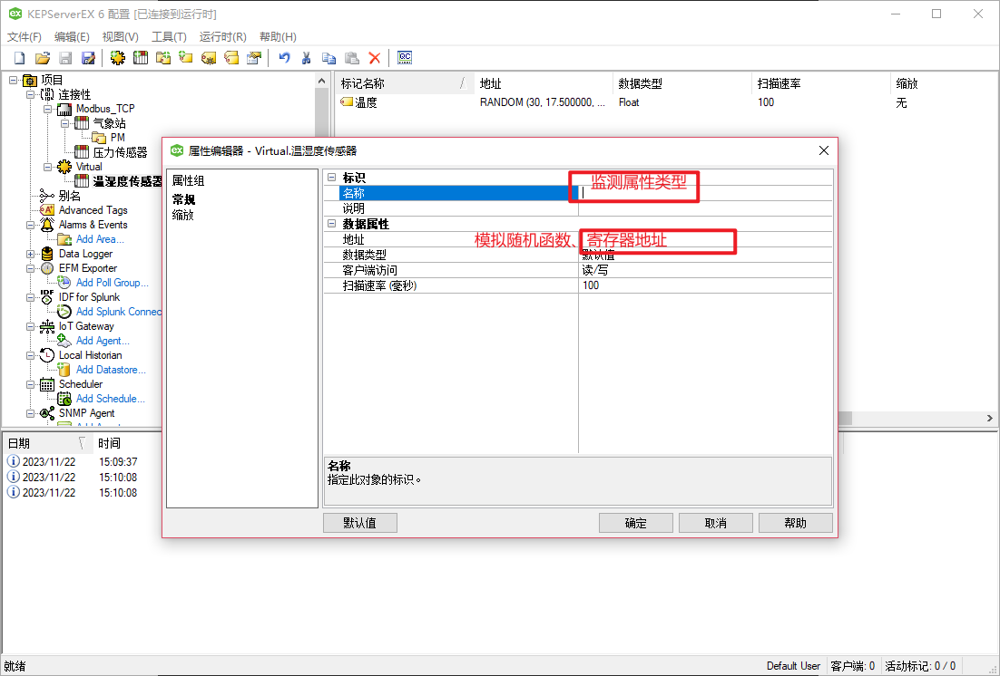

OPC（OLE for Process Control）是一组标准和规范，旨在促进工业自动化中不同
设备和系统之间的互操作性。它最初是由微软提出的，后来成为一个开放的行业标准。
OPC 的目标是简化和标准化在工业自动化系统中进行数据交换的过程。
#### OPC协议规范
DA（Data Access）规范：实时数据。

A&E（Alarm and Event）规范：报警和事件数据。

HDA（History Data Acess）规范：历史数据；

**UA（Unified Architecture）规范：OPC UA 是一个更现代、跨平台、独立于
厂商和网络的规范。与 OPC Classic 不同，OPC UA 不依赖于 Microsoft 的 
COM/DCOM 技术，而是使用独立的协议。它提供了更强大的安全性、可扩展性和灵活性，
支持更广泛的数据模型和信息建。**


#### OPC Server 软件

**KEPServerEX**  
KEPServerEX 是一款由 Kepware 公司开发的工业自动化数据通信平台。
它是一个灵活、可扩展的软件，用于连接、管理和通信不同供应商的工业设备、
控制系统和软件应用程序。KEPServerEX 提供了多种通信协议的支持，
包括 OPC（OLE for Process Control）、Modbus、SNMP、DNP3、OPC UA 等，
使其能够与各种设备和系统进行集成。  
首页：https://www.ptc.com/en/products/kepware/kepserverex

**添加通道（网关）**

1. 选择协议（Simulator为虚拟设备）

2. 设置网关id

3. 进行相应的配置（如modbus则需要配置slaveId，寄存器起始地址等）

**添加设备**

4. 设置设备id

5. 设备设置

**添加监测点**

填写对应配置

#### OPC库

**milo（star 1k）**

github:https://github.com/eclipse/milo

首页：https://projects.eclipse.org/projects/iot.milo

```xml
<!--引入milo客户端依赖-->
        <dependency>
            <groupId>org.eclipse.milo</groupId>
            <artifactId>sdk-client</artifactId>
            <version>0.6.8</version>
        </dependency>
        <dependency>
            <groupId>org.eclipse.milo</groupId>
            <artifactId>sdk-server</artifactId>
            <version>0.6.8</version>
        </dependency>
        <!--数字证书解析依赖-->
        <dependency>
            <groupId>org.bouncycastle</groupId>
            <artifactId>bcpkix-jdk15on</artifactId>
            <version>1.70</version>
        </dependency>
```

OPC常用开源库：https://blog.csdn.net/whahu1989/article/details/106452683

#### 步骤

1. 与服务端建立连接
```java
 public static OpcUaClient createClient() throws Exception {
        //opc ua服务端地址
        final String endPointUrl = "opc.tcp://127.0.0.1:49320";
        Path securityTempDir = Paths.get(System.getProperty("java.io.tmpdir"), "security");
        Files.createDirectories(securityTempDir);
        if (!Files.exists(securityTempDir)) {
            throw new Exception("unable to create security dir: " + securityTempDir);
        }
        return OpcUaClient.create(endPointUrl,
                endpoints ->
                        endpoints.stream()
                                .filter(e -> e.getSecurityPolicyUri().equals(SecurityPolicy.None.getUri()))
                                .findFirst(),
                configBuilder ->
                        configBuilder
                                .setApplicationName(LocalizedText.english("eclipse milo opc-ua client"))
                                .setApplicationUri("urn:eclipse:milo:examples:client")
                                //访问方式
                                .setIdentityProvider(new AnonymousProvider())
                                .setRequestTimeout(UInteger.valueOf(5000))
                                .build()
        );
    }
```
2. 读取节点数据
```java
private static void readNode(OpcUaClient client) throws Exception {
        int namespaceIndex = 2;
        String identifier = "Modbus_TCP.气象站.大气压强";
        //节点
        NodeId nodeId = new NodeId(namespaceIndex, identifier);
        //读取节点数据
        DataValue value = client.readValue(0.0, TimestampsToReturn.Neither, nodeId).get();
        //标识符
        identifier = String.valueOf(nodeId.getIdentifier());
        System.out.println(identifier + ": " + String.valueOf(value.getValue().getValue()));
    }
```
3. 订阅或批量订阅
```java

/**
 * 批量订阅
 *
 * @param client
 * @throws Exception
 */
private static void managedSubscriptionEvent(OpcUaClient client) throws Exception {
final CountDownLatch eventLatch = new CountDownLatch(1);

        //添加订阅监听器，用于处理断线重连后的订阅问题
        client.getSubscriptionManager().addSubscriptionListener(new CustomSubscriptionListener(client));

        //处理订阅业务
        handlerNode(client);

        //持续监听
        eventLatch.await();
        }

/**
 * 处理订阅业务
 *
 * @param client OPC UA客户端
 */
private static void handlerNode(OpcUaClient client) {
        try {
        //创建订阅
        ManagedSubscription subscription = ManagedSubscription.create(client);

        //你所需要订阅的key
        List<String> key = new ArrayList<>();
        key.add("Modbus_TCP.气象站.大气压强");
        key.add("Modbus_TCP.气象站.温度");
        key.add("Virtual.温湿度传感器.温度");
        key.add("Modbus_TCP.气象站.PM.PM10");

        List<NodeId> nodeIdList = new ArrayList<>();
        for (String s : key) {
        nodeIdList.add(new NodeId(2, s));
        }

        //监听
        List<ManagedDataItem> dataItemList = subscription.createDataItems(nodeIdList);
        for (ManagedDataItem managedDataItem : dataItemList) {
        managedDataItem.addDataValueListener((t) -> {
        System.out.println(managedDataItem.getNodeId().getIdentifier().toString() +
        ":" + t.getValue().getValue().toString());
        });
        }
        } catch (Exception e) {
        e.printStackTrace();
        }
        }

```

参考：https://blog.csdn.net/u013810234/article/details/130175531


### 待确认的方案
1. 初始化服务器
2. 创建监测点节点
3. 监听节点变化
4. 存入数据库


### Milo Client API

##### 连接

