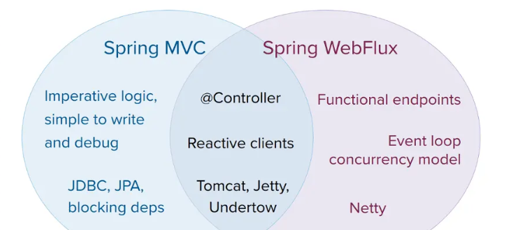

### Webflux响应式编程
#### what
    WebFlux是Spring推出的响应式框架。对标SringMVC框架。webflux通过少量稳定线程
    帮助我们更好地利用服务器，提高吞吐量。webflux在IO堵塞的时候，
    工作线程不再等待去处理其他请求。响应式编程式异步非阻塞的。

    WebFlux与SpringMVC区别：  
- 命令式编程 VS 声明式编程
- 并发模型 Thread Per Request VS EventLoop
- 技术栈 响应式技术栈 VS Servlet技术栈  
- 响应式编程与Reactor
- 
#### why
- 在IO密集型的服务中，能提高吞吐量。
- 固定的线程处理高并发，不需要再处理底层的高并发模型。
- WebFlux还支持服务器推送(SSE - >Server Send Event)
#### how
```java
/**
     * Flux : 返回0-n个元素
     * 注：需要指定MediaType
     * @return
     */
@GetMapping(value = "/3", produces = MediaType.TEXT_EVENT_STREAM_VALUE)
private Flux<String> flux() {
    Flux<String> result = Flux
        .fromStream(IntStream.range(1, 5).mapToObj(i -> {
            try {
                TimeUnit.SECONDS.sleep(1);
            } catch (InterruptedException e) {
            }
            return "flux data--" + i;
        }));
    return result;
}
```
